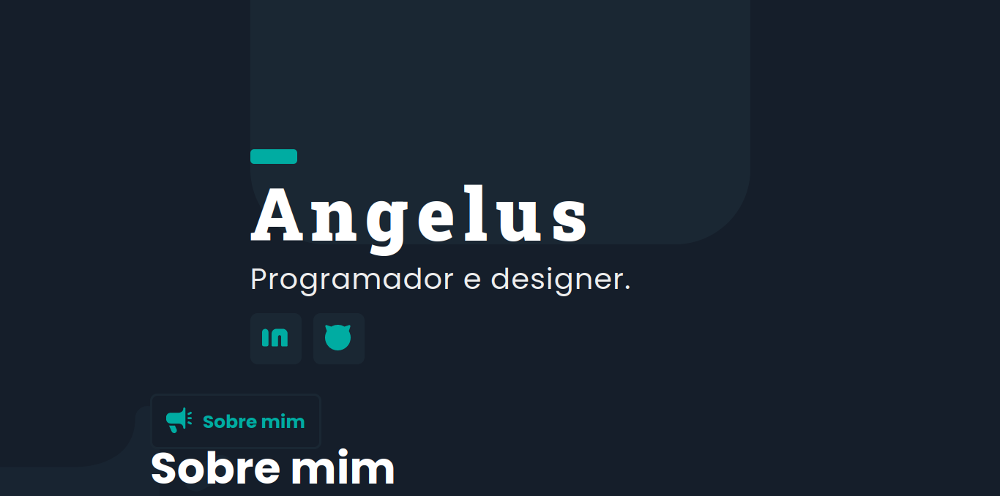

# Proposta de portfólio
Por: Angelus Trindade

Um site-portfolio mostrando minha proposta de trabalho.

## Instalando 

Para executar o projeto, baixe o zip e extraia.
Na pasta/directório, com o terminal execute:

### `npm install` e `npm start`

O programa iniciará no seu navegador automáticamente no URL: 
http://localhost:3000

## Projeto
O portfólio consiste respectivamente de:
Introdução, sobre mim, formação, objetivos, posso oferecer, e projetos

### 🤖 Tecnologias usadas: 
HTML, CSS, SCSS, Javascript, React

### 🔧 Site hospedado: 
https://angelus.atlascomputing.com.br/

### 💡Pranchetas de design (figma):
https://www.figma.com/file/hzIRFWUgg0Nc9MxALpJ4ms/angelus-portfolio?node-id=0%3A1